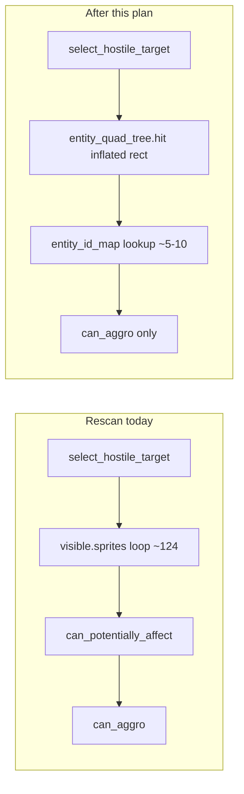

# Aggro spatial query — implementation plan

## Problem

[`CombatUnit.select_hostile_target`](Code/combat_unit.py) still loops all `visible_sprites` (~124) on every cache miss, calling `can_potentially_affect` + `can_aggro` per candidate. The prior cache cut rescan frequency but **moved cost** (~20s new prefilter vs ~45% drop inside `select_hostile_target`). Net level time barely changed.



**Root cause:** `entity_quad_tree` is passed into `enemy_update` but never used for target selection ([`combat_update` line 671](Code/combat_unit.py) calls `select_hostile_target` without the tree).

---

## Change 1 — Replace rescan body, then delete `_scan_hostiles`

**File:** [`Code/combat_unit.py`](Code/combat_unit.py)

**Order matters — do not delete before replacing:**

1. Implement the new spatial candidate fetch + two-pass policy loop inside `select_hostile_target` (Change 3 below) — **no** `can_potentially_affect`; `can_aggro` only on the candidate set.
2. Switch `select_hostile_target` to call the new logic exclusively.
3. **Then** delete the old [`_scan_hostiles`](Code/combat_unit.py) helper (lines 418–440) so the prefilter and `visible.sprites()` loop cannot linger.

---

## Change 2 — Per-frame `id → sprite` dict

**File:** [`Code/Level4_tmxdev.py`](Code/Level4_tmxdev.py) (~line 2030, before enemy pass)

Build once per frame immediately before the existing `enemy_update` loop:

```python
entity_id_map = {
    s.id: s
    for s in self.layout_manager.visible_sprites.sprites()
    if hasattr(s, "id")
}
```

Pass into `enemy_update` alongside the tree already passed as `quadtree`:

```python
sprite.enemy_update(
    None,
    self.layout_manager.entity_quad_tree,
    frame_number=self._frame_number,
    entity_id_map=entity_id_map,
)
```

~124 dict inserts/frame is negligible vs removing ~124 policy checks per rescan per unit. No `register_entity` / `.kill()` grep required for v1.

---

## Change 3 — Spatial query in `select_hostile_target`

**File:** [`Code/combat_unit.py`](Code/combat_unit.py)

### Signature (defaults preserve existing callers)

```python
def select_hostile_target(self, frame_number=0, entity_id_map=None, entity_quad_tree=None):
```

Tests and [`Code/rts/behavior_drivers.py`](Code/rts/behavior_drivers.py) (`CombatDriver` line 93) call with no args — they fall through to the `visible_sprites` fallback automatically.

### Candidate fetch

After cache miss and `prefer_team = self._current_prefer_team(now)`:

```python
notice_radius = self._notice_radius()
use_spatial = (
    entity_quad_tree is not None
    and entity_id_map is not None
    and notice_radius != math.inf
)
if use_spatial:
    r = int(notice_radius)
    query_rect = self.rect.inflate(r * 2, r * 2)
    hits = entity_quad_tree.hit(HashableRect(query_rect, self.id))
    candidates = [
        entity_id_map[h._id]
        for h in hits
        if h._id in entity_id_map
    ]
else:
    # inf radius OR tree/map unavailable — preserve global-aggro behavior
    visible = getattr(level.layout_manager, "visible_sprites", None)
    candidates = visible.sprites() if visible is not None else []
```

- `HashableRect` is already imported in [`combat_unit.py`](Code/combat_unit.py) line 7.
- `inflate(r * 2, r * 2)` keeps center fixed, adds `r` per side — same pattern as collision docs in [`Code/docs/aggro_target_cache_extract.txt`](Code/docs/aggro_target_cache_extract.txt).
- **Distance check still required** after spatial query — AABB corners extend beyond the circle.

### Policy loop (prefer_team before can_aggro on pass 1)

Pass 1 (restrict to `prefer_team` when set):

1. `_is_valid_aggro_target`
2. `prefer_team` team filter (cheap)
3. `can_aggro` (expensive)
4. distance ≤ `notice_radius`
5. nearest wins

Pass 2 (fallback when pass 1 finds nothing and `prefer_team` is set): same without team filter.

Store cache with **store-time stagger** (see Change 5):

```python
self._aggro_target_cache = best_target
self._aggro_cache_frame = frame_number - (self.id % CombatUnit._AGGRO_CACHE_TTL)
self._aggro_cache_prefer_team = prefer_team
```

---

## Change 4 — Wire kwargs through combat loop

**File:** [`Code/combat_unit.py`](Code/combat_unit.py)

```python
def combat_update(self, player=None, quadtree=None, frame_number=0, entity_id_map=None):
    target = self.select_hostile_target(
        frame_number=frame_number,
        entity_id_map=entity_id_map,
        entity_quad_tree=quadtree,  # same object Level already passes
    )
    ...

def enemy_update(self, player=None, quadtree=None, frame_number=0, entity_id_map=None):
    self.combat_update(player, quadtree, frame_number=frame_number, entity_id_map=entity_id_map)
```

Use the existing `quadtree` kwarg internally — no duplicate parameter at the Level call site.

---

## Change 5 — TTL stagger via store-time offset (not additive TTL)

**File:** [`Code/combat_unit.py`](Code/combat_unit.py)

**Do not use** `TTL + (id % TTL)` on the validate check — that extends max wait up to ~2×TTL−1 (e.g. 29 frames for TTL=15).

**Do not use** init-only `_aggro_cache_frame = -(id % TTL)` in `__init__` — it is overwritten on every cache store and does not spread post-spawn rescans.

**Use store-time offset** when writing the cache (Change 3) plus a **plain elapsed check**:

```python
def _aggro_cache_valid(self, now, frame_number):
    if self._aggro_target_cache is None:                          # free
        return False
    if frame_number - self._aggro_cache_frame >= CombatUnit._AGGRO_CACHE_TTL:  # plain elapsed
        return False
    if self._current_prefer_team(now) != self._aggro_cache_prefer_team:        # cheap
        return False
    if not self._is_valid_aggro_target(self._aggro_target_cache):              # attr checks
        return False
    distance, _ = self.get_target_distance_direction(self._aggro_target_cache)
    if distance > self._notice_radius():                                       # vector math — last
        return False
    return True
```

On cache store (after rescan):

```python
self._aggro_cache_frame = frame_number - (self.id % CombatUnit._AGGRO_CACHE_TTL)
```

This spreads rescans across frames (units with different ids refresh on different frames) without lengthening the TTL itself. Some units may refresh sooner than TTL frames after store (e.g. high `id % TTL`); that is acceptable — playtest if it feels too eager.

Keep `_aggro_cache_frame = -1` in `__init__` (unchanged). Cache bust on damage in [`receive_interaction`](Code/combat_unit.py) (line 616: `_aggro_target_cache = None`) remains sufficient — no need to reset `_aggro_cache_frame`.

---

## Out of scope (explicit deferrals)

| Item | Reason |
|------|--------|
| **RTS `CombatDriver` spatial wiring** | [`behavior_drivers.py`](Code/rts/behavior_drivers.py) calls `select_hostile_target()` with no map/tree — falls back safely; wire `DriverContext` later if RTS combat profiling is hot |
| **Maintained add/remove `_entity_id_map`** | Only if per-frame build ever shows up in profile (unlikely) |
| **Legacy `Enemy` / `Friendly` aggro** | Subclass `Entity` directly, not `CombatUnit` |
| **`Level4.py`** | Main game uses `Level4_tmxdev` via [`Main2.py`](Code/Main2.py) |

---

## Verification

1. **Unit test:** [`tests/rts/test_notice_radius_targeting.py`](tests/rts/test_notice_radius_targeting.py) — must pass (uses visible fallback via mocks without tree/map).
2. **Policy sanity:** ally pairs never aggro; hostile pairs do; retaliation after hit still switches target (cache bust + prefer_team).
3. **Inf-radius units:** still pick targets via `visible_sprites` fallback when `notice_radius == math.inf`.
4. **Re-profile:** run [`Code/game_cProfile.py`](Code/game_cProfile.py) — expect:
   - `can_potentially_affect` **gone** from top 20 on aggro path
   - `can_aggro` calls **~10–20×** lower vs current ~3.8M
   - `select_hostile_target` cumtime **significantly** lower

| Metric | Current (approx.) | Expected |
|--------|-------------------|----------|
| Candidates per rescan | ~124 | ~5–10 |
| `can_aggro` calls | ~3.8M | ~150–300k |
| `can_potentially_affect` (aggro) | ~3.8M | 0 |
| Per-frame id map build | 0 | ~124 inserts (negligible) |

---

## Files changed

| File | Change |
|------|--------|
| [`Code/combat_unit.py`](Code/combat_unit.py) | Spatial query + fallback in `select_hostile_target`; remove prefilter; delete `_scan_hostiles` after replacement; store-time TTL stagger; wire `entity_id_map` / `entity_quad_tree` through combat loop |
| [`Code/Level4_tmxdev.py`](Code/Level4_tmxdev.py) | Per-frame `entity_id_map`; pass to `enemy_update` |
