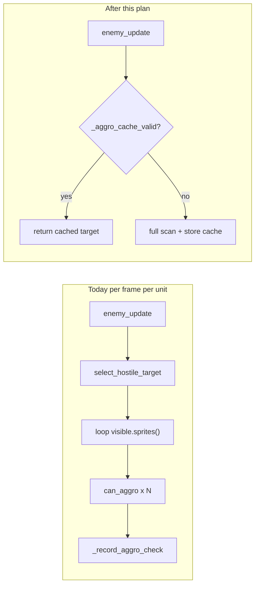

# Aggro target selection — performance fix

## Problem

[`CombatUnit.select_hostile_target`](Code/combat_unit.py) scans **all** `visible_sprites` every `enemy_update`, calling `can_aggro` → `should_aggro` per candidate. Profile: ~8.7M aggro checks / ~2.8k frames; ~65s cumulative in target selection.

Spawner creates [`CombatUnit`](Code/Spawner.py) only — **not** legacy [`Enemy`](Code/Enemy.py) / [`Friendly`](Code/friendly.py) (both subclass `Entity` directly). Fix targets `CombatUnit` + level wiring.



## Change 1 — Telemetry gate (small, independent)

**File:** [`Code/Level4_tmxdev.py`](Code/Level4_tmxdev.py) (~line 323)

Today:
```python
self.interaction_resolver = InteractionResolver(telemetry_sink=self.benchmark_runtime.metrics)
```

Fix — only attach sink when benchmark is active:
```python
sink = (
    self.benchmark_runtime.metrics
    if self.benchmark_runtime.enabled and self.benchmark_runtime.metrics_enabled
    else None
)
self.interaction_resolver = InteractionResolver(telemetry_sink=sink)
```

[`InteractionResolver._record_aggro_check`](Code/Interaction.py) already no-ops when `sink is None`. No other changes needed.

**Note:** Main game uses `Level4` from `Level4_tmxdev` via [`Main2.py`](Code/Main2.py). Legacy [`Level4.py`](Code/Level4.py) is out of scope unless you still run it.

## Change 2 — Target cache on CombatUnit

**File:** [`Code/combat_unit.py`](Code/combat_unit.py)

### Class constant

```python
class CombatUnit(Entity):
    _AGGRO_CACHE_TTL = 15  # frames; tune after playtest; not per-instance
```

### Init (near `recent_attacker_*` fields ~line 60)

Group with a comment `# --- aggro target cache ---`:
```python
self._aggro_target_cache = None
self._aggro_cache_frame = -1
self._aggro_cache_prefer_team = None  # prefer_team snapshot at last full scan
```

### Shared notice radius

Use in both `_aggro_cache_valid` and `select_hostile_target` (never duplicate logic):

```python
def _notice_radius(self):
    return float(self.combat_config.get("notice_radius", math.inf))
```

When key is missing, default is `math.inf` — distance check always passes; do **not** add a guard that treats inf as invalid.

### `_current_prefer_team(now)` — explicit body

```python
def _current_prefer_team(self, now):
    retaliate_until = getattr(self, "retaliate_until_ms", 0)
    retaliate_team = getattr(self, "retaliate_team_id", None)
    if retaliate_team and now < retaliate_until:
        return retaliate_team
    if now < self.recent_attacker_until_ms:
        return self.recent_attacker_team_id
    return None
```

### `_aggro_cache_valid(now, frame_number)` — check order matters

Return False in this order (cheap checks before expensive distance math):

1. **`self._aggro_target_cache is None`**
2. **Staggered TTL expired** — avoids all units rescanning on the same frame:
   ```python
   stagger = self.id % CombatUnit._AGGRO_CACHE_TTL
   if frame_number - self._aggro_cache_frame >= CombatUnit._AGGRO_CACHE_TTL + stagger:
       return False
   ```
   Unit 0 refreshes at +15 frames, unit 14 at +29; spreads scan load across frames.
3. **`prefer_team` mismatch** (integer/string compare, no distance):
   ```python
   if self._current_prefer_team(now) != self._aggro_cache_prefer_team:
       return False
   ```
4. **`not self._is_valid_aggro_target(self._aggro_target_cache)`** (dead / no rect)
5. **Distance vs notice radius** (expensive — last):
   ```python
   distance, _ = self.get_target_distance_direction(self._aggro_target_cache)
   if distance > self._notice_radius():
       return False
   ```
6. Otherwise return True.

Hard invalidation (steps 3–5) runs every frame when cache exists; TTL (step 2) only forces periodic rescan on staggered schedule.

### `select_hostile_target(self, frame_number=0)`

1. Early exit if no resolver/visible (unchanged).
2. `now = pygame.time.get_ticks()`
3. If `_aggro_cache_valid(now, frame_number)`: return `_aggro_target_cache`.
4. Full scan — existing two-pass loop (prefer_team + fallback), using `self._notice_radius()` and `prefer_team = self._current_prefer_team(now)`.
5. On rescan only, before `can_aggro`: skip when `not resolver.can_potentially_affect(self.team_id, getattr(candidate, "team_id", None))` (projectile prefilter pattern in [`Level4_tmxdev.py`](Code/Level4_tmxdev.py) ~1399).
6. Store cache:
   ```python
   self._aggro_target_cache = best_target
   self._aggro_cache_frame = frame_number
   self._aggro_cache_prefer_team = prefer_team
   ```
7. Return `best_target`.

### Cache bust on damage (immediate, bypasses TTL)

In **`receive_interaction`**, when `recent_attacker_team_id` is set:
```python
self._aggro_target_cache = None
```

### Wire `frame_number` through combat loop

**`combat_update` / `enemy_update`** — add `frame_number=0` kwarg; pass to `select_hostile_target`.

**File:** [`Code/Level4_tmxdev.py`](Code/Level4_tmxdev.py)

- Init: `self._frame_number = 0`
- In update loop, before enemy pass (~2031): `self._frame_number += 1`
- Call: `sprite.enemy_update(None, self.layout_manager.entity_quad_tree, frame_number=self._frame_number)`

## Out of scope (explicit deferrals)

| Item | Reason |
|------|--------|
| **Spatial `entity_quad_tree` query** | Re-profile after cache; full scan only on staggered TTL / hard invalidation |
| **Delete `Enemy`/`Friendly` overrides** | They do **not** inherit `CombatUnit`; dedup is a separate refactor |
| **Policy / `should_aggro` changes** | Behavior unchanged |
| **`Level4.py`** | Not used by Main2 |

## Verification

1. **Unit test:** [`tests/rts/test_notice_radius_targeting.py`](tests/rts/test_notice_radius_targeting.py) — must still pass.
2. **Manual / policy sanity:** enemy_1 vs enemy_2 (ally) never aggro; enemy_1 vs enemy_3 (hostile) do; retaliation switches target after hit (cache bust + prefer_team rescan).
3. **Re-profile:** run [`Code/game_cProfile.py`](Code/game_cProfile.py); expect large drop in `can_aggro` / `select_hostile_target` cumulative time vs baseline (~8.7M aggro checks).

## Follow-up (only if still hot after re-profile)

- Replace `visible.sprites()` loop with `entity_quad_tree.hit(HashableRect(rect.inflate(2*r, 2*r), id))` + sprite resolution (see [`Code/docs/aggro_target_cache_extract.txt`](Code/docs/aggro_target_cache_extract.txt)).
- Extract shared aggro logic for legacy `Enemy`/`Friendly` or migrate them to subclass `CombatUnit`.
- Optional: expose `aggro_cache_ttl` via `combat_config` instead of class constant.
