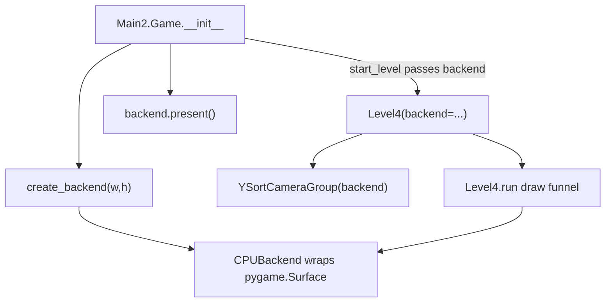
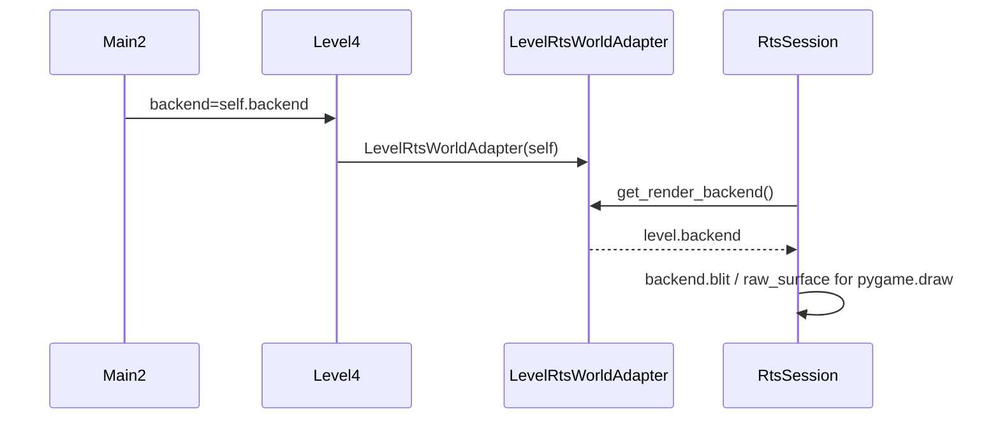

# Phase 0 — CPU Backend Passthrough

## Goal

Establish the `RenderBackend` abstraction with a zero-cost `CPUBackend` wrapper so gameplay code stops calling `pygame.display.set_mode`, `get_surface`, and direct framebuffer `blit`/`fill`/`update`. This unblocks Phase 1 (OpenGL context) without changing visuals.

**Pass criteria:** game identical at `RENDER_BACKEND=cpu`; zero `set_mode` outside [`Main2.py`](Code/Main2.py); SRCALPHA visual checklist passed; grep audit clean; pytest green.

---

## Current problem (must fix first)


Today [`Main2.start_level`](Code/Main2.py) creates `Level4(...)` without a display/backend, so [`Level4.start_map`](Code/Level4_tmxdev.py) always hits lines 280–283 and re-calls `set_mode` with `SRCALPHA`.

---

## Target architecture (Phase 0)



---

## Step 1 — Settings constants

**File:** [`Code/Settings.py`](Code/Settings.py)

Add near game setup block:

```python
RENDER_BACKEND = "cpu"  # "cpu" | "gpu" (gpu in Phase 1)
DISPLAY_FLAGS = pygame.SRCALPHA
```

`DISPLAY_FLAGS` must be imported after `pygame` is available in Settings (Settings already uses pygame elsewhere or add `import pygame` if missing).

---

## Step 2 — New `render_backend.py`

**File:** [`Code/render_backend.py`](Code/render_backend.py) (new)

```python
class RenderBackend:
    def get_size(self) -> tuple[int, int]: ...
    def begin_frame(self, clear_color=(0, 0, 0)): ...
    def blit(self, surface, dest, *, flags=0, area=None): ...
    def fill(self, color, rect=None): ...
    def present(self): ...
    @property
    def raw_surface(self) -> pygame.Surface | None: ...

def create_backend(width, height) -> RenderBackend:
    if RENDER_BACKEND == "cpu":
        surface = pygame.display.set_mode((width, height), DISPLAY_FLAGS)
        return CPUBackend(surface)
    raise NotImplementedError("gpu backend is Phase 1")
```

**`CPUBackend`:** thin passthrough — delegate `blit`/`fill`/`present`/`get_size` to wrapped surface; `present()` calls `pygame.display.update()`.

**No `subsurface()` on RenderBackend** — grass uses `raw_surface.subsurface()` directly (documented exception).

---

## Step 3 — Centralize display in Main2

**File:** [`Code/Main2.py`](Code/Main2.py)

| Change | Detail |
|--------|--------|
| `Game.__init__` | Replace `pygame.display.set_mode((w,h))` with `self.backend = create_backend(w, h)` |
| Screen alias | `self.screen = self.backend.raw_surface` — keeps menu code (Phase 3 defer) working |
| `start_level` | Pass `backend=self.backend` into `Level4(...)` |
| `run()` | `pygame.display.update()` → `self.backend.present()` |
| Debug overlay (line 364) | `self.screen.blit(...)` → `self.backend.blit(...)` |

---

## Step 4 — Level4 accepts backend, removes set_mode

**File:** [`Code/Level4_tmxdev.py`](Code/Level4_tmxdev.py)

### Constructor chain

- `Level4.__init__(..., backend=None)` — **require** backend (assert if None in Phase 0)
- `start_map(..., backend=None, display_surface=None)` — replace `display_surface` param with `backend`; on layout-switch restart pass `backend=self.backend` (line 1299), not `display_surface`

### Remove display recreation (lines 275–283)

```python
# BEFORE (delete)
if display_surface: ...
else: get_surface(); set_mode(SRCALPHA)

# AFTER
assert backend is not None
self.backend = backend
```

### Replace framebuffer operations

All `self.display_surface.blit/fill/get_size/get_width/get_height` in the level draw path become `self.backend.blit/fill/get_size`. Key sites:

| Lines | Call |
|-------|------|
| 1835 | `backend.fill((0,0,0))` |
| 578, 610 | gold / RTS popup panels |
| 971 | interact prompt |
| 1740–1741 | popup shadow + text |
| 1994 | torch halos `BLEND_RGBA_ADD` |
| 1910 | `daytime_brightness_overlay.draw()` (overlay updated to use backend) |
| 1913 | `weather_overlay.draw()` |
| 2036 | `ui.display()` (UI updated to use backend) |
| 2120 | `layout_manager.display_time(backend)` |
| 2127 | `draw_belt_hud(backend, ...)` |
| 2129 | `rts_session.draw()` (session uses adapter) |

### Overlay / UI injection at init

- `WeatherOverlay(backend)` — store backend, draw via `backend.blit`
- `UI(backend)` — replace `get_surface()` in [`UI.py`](Code/UI.py)
- `Upgrade(self.player, self.input_manager, backend)` — replace `get_surface()` in [`Upgrade.py`](Code/Upgrade.py)
- `daytime_brightness_overlay.set_display_surface(...)` → `set_backend(backend)` (rename method or add alias)

### Paused-menu shims (minimal scope)

Paused paths that pass a surface to child components (`inventory.display`, `attack_selection.display`, `player_config.draw`) may receive `backend.raw_surface` temporarily — these compose off-screen UI, not the main funnel. Document as shim; full migration optional in Phase 0.

### Dead code (do not wire)

Duplicate `YSortCameraGroup` classes at [`Level4_tmxdev.py:2157+`](Code/Level4_tmxdev.py) and [`Level4.py`](Code/Level4.py) are unused by Main2. Optional cleanup note only — do not modify unless trivial.

---

## Step 5 — YSortCameraGroup + LayoutManager

**Files:** [`Code/YsortCameraGroup.py`](Code/YsortCameraGroup.py), [`Code/tmx_layout_manager.py`](Code/tmx_layout_manager.py)

### YSortCameraGroup

- `__init__(self, ground_sprites, grass_manager, overhead_areas, backend)` — replace `get_surface()` (line 42)
- Store `self.backend = backend`
- `custom_draw` blit sites (195, 252, 268) → `self.backend.blit(...)`
- Debug `pygame.draw.*` sites (281, 290, 305) → `self.backend.raw_surface` with comment: *pygame.draw requires Surface; Phase 2a may add backend helpers*
- **Grass exception (only allowed `raw_surface` use):**

```python
# YSortCameraGroup._apply_grass_viewport — Phase 0 intentional exception
self.grass_surface = self.backend.raw_surface.subsurface(clip_rect)
```

- Size queries: `backend.get_size()` instead of `display_surface.get_size()`

### LayoutManager

- Add `backend` param to `__init__`
- Pass to `YSortCameraGroup(..., backend=backend)` (line 139)
- `display_time(self, backend)` — `backend.blit(...)` + `backend.get_size()`

### Level4 → LayoutManager wiring

When creating `LayoutManager(...)` in `start_map`, pass `backend=self.backend`. On layout-switch restart (`restart=True`), existing `layout_manager` is reused — YSortCameraGroup already holds backend from first init; no recreation needed.

---

## Step 6 — Overlay modules

### [`Code/DaytimeBrightnessOverlay.py`](Code/DaytimeBrightnessOverlay.py)

- Hold `self.backend` instead of `self.display_surface`
- `set_backend(backend)` replaces `set_display_surface`
- `draw()`: `self.backend.blit(brightness_surface, (0,0), flags=pygame.BLEND_RGB_MULT)`

### [`Code/WeatherOverlay.py`](Code/WeatherOverlay.py)

- Constructor takes `backend`; `draw()` uses `backend.blit(frame, (0,0))`

### [`Code/UI.py`](Code/UI.py)

- `__init__(self, backend)` — store backend
- All `self.display_surface.blit` → `self.backend.blit`
- All `pygame.draw.rect(self.display_surface, ...)` → `pygame.draw.rect(self.backend.raw_surface, ...)` (documented shim for pygame.draw API)

### [`Code/Inventory.py`](Code/Inventory.py) — `draw_belt_hud` only

- Change signature to accept `backend` (or duck-type with `.blit`/`.get_size`)
- Replace `screen.blit` → `backend.blit`; size queries via `backend.get_size()`

---

## Step 7 — RTS adapter wiring

**Injection model:** once at Level4 init, indirect via existing adapter — not per-call.



### Changes

| File | Change |
|------|--------|
| [`Code/rts/world_adapter.py`](Code/rts/world_adapter.py) | Add abstract `get_render_backend()` |
| [`Code/Level4_tmxdev.py`](Code/Level4_tmxdev.py) `LevelRtsWorldAdapter` | `get_render_backend()` → `return self.level.backend` |
| [`Code/rts/session.py`](Code/rts/session.py) `camera_rect` (~142) | `backend = self.world.get_render_backend()`; `backend.get_size()` |
| [`Code/rts/session.py`](Code/rts/session.py) `draw` (~636) | `backend = self.world.get_render_backend()`; session-owned blits → `backend.blit`; `pygame.draw.rect` → `backend.raw_surface` |
| RTS UI panels (`resource_bar`, `panel`, `chief_panel`, `worker_command_panel`) | **Phase 0 shim:** session passes `backend.raw_surface` to existing `.draw(surface, ...)` signatures — no panel file changes |
| Deprecate `get_display_surface()` | Keep method returning `backend.raw_surface` temporarily for any stragglers; add comment `# deprecated Phase 0` |

### Test fakes

Update [`tests/rts/fakes.py`](tests/rts/fakes.py) `FakeWorldAdapter` with `get_render_backend()` returning a `CPUBackend` wrapping `self.surface`.

---

## Step 8 — Mandatory grep audit gate

Run before merge; every hit in level-path files must match inventory below or be explicitly deferred.

```bash
rg 'pygame\.display\.(get_surface|set_mode)\(' Code/ --glob '*.py'
rg '\.blit\(' Code/Main2.py Code/Level4_tmxdev.py Code/YsortCameraGroup.py \
   Code/DaytimeBrightnessOverlay.py Code/WeatherOverlay.py Code/UI.py \
   Code/tmx_layout_manager.py Code/Inventory.py Code/rts/session.py
```

### `set_mode` / `get_surface` — must eliminate in level path

| File | Line(s) | Fix | Status |
|------|---------|-----|--------|
| [`Level4_tmxdev.py`](Code/Level4_tmxdev.py) | 280–283 | Remove; receive `backend` from Main2 | [ ] |
| [`YsortCameraGroup.py`](Code/YsortCameraGroup.py) | 42 | Accept `backend` in ctor | [ ] |
| [`UI.py`](Code/UI.py) | 12 | Inject `backend` at init | [ ] |
| [`Upgrade.py`](Code/Upgrade.py) | 10 | Inject `backend` at init | [ ] |
| [`DaytimeBrightnessOverlay.py`](Code/DaytimeBrightnessOverlay.py) | 6, 19–20 | Hold `backend` ref | [ ] |
| [`WeatherOverlay.py`](Code/WeatherOverlay.py) | 5–6 | Hold `backend` ref | [ ] |

### `set_mode` / `get_surface` — explicitly deferred (do not touch Phase 0)

| File | Reason |
|------|--------|
| [`Main2.py`](Code/Main2.py) menus use `self.screen` | Phase 3 |
| [`StartMenu.py`](Code/StartMenu.py), [`LevelSelection.py`](Code/LevelSelection.py), [`PlayerConfiguration.py`](Code/PlayerConfiguration.py), [`DeathMenu.py`](Code/DeathMenu.py), [`SettingsMenu.py`](Code/SettingsMenu.py) | Phase 3 |
| [`Level4_tmxdev.py`](Code/Level4_tmxdev.py) dead duplicate classes ~2160, 2491 | Dead code |
| [`Level4.py`](Code/Level4.py) | Legacy, not Main2 entry |
| [`shader_test.py`](Code/shader_test.py), [`grass_demo.py`](Code/grass_demo.py), [`client.py`](Code/client.py), [`tmx_layout_manager_dev.py`](Code/tmx_layout_manager_dev.py) | Dev/demo |
| [`Debug.py`](Code/Debug.py) | Unused in active path (import only) |
| Test files | Own `set_mode` for headless fixtures — allowed |

### Must route through `backend` — blit/fill/present checklist

| File | Site | What | Status |
|------|------|------|--------|
| [`Main2.py`](Code/Main2.py) | 320 | `present()` | [ ] |
| [`Main2.py`](Code/Main2.py) | 364 | debug overlay blit | [ ] |
| [`Level4_tmxdev.py`](Code/Level4_tmxdev.py) | 1835 | frame clear fill | [ ] |
| [`Level4_tmxdev.py`](Code/Level4_tmxdev.py) | 578, 610 | gold / RTS popup panels | [ ] |
| [`Level4_tmxdev.py`](Code/Level4_tmxdev.py) | 971 | interact prompt | [ ] |
| [`Level4_tmxdev.py`](Code/Level4_tmxdev.py) | 1740–1741 | popup shadow + text | [ ] |
| [`Level4_tmxdev.py`](Code/Level4_tmxdev.py) | 1994 | torch halos `BLEND_RGBA_ADD` | [ ] |
| [`Level4_tmxdev.py`](Code/Level4_tmxdev.py) | 1910 | daytime overlay draw | [ ] |
| [`Level4_tmxdev.py`](Code/Level4_tmxdev.py) | 1913 | weather overlay draw | [ ] |
| [`Level4_tmxdev.py`](Code/Level4_tmxdev.py) | 2036 | `ui.display()` | [ ] |
| [`Level4_tmxdev.py`](Code/Level4_tmxdev.py) | 2120 | `display_time()` | [ ] |
| [`Level4_tmxdev.py`](Code/Level4_tmxdev.py) | 2127 | `draw_belt_hud()` | [ ] |
| [`Level4_tmxdev.py`](Code/Level4_tmxdev.py) | 2129 | `rts_session.draw()` | [ ] |
| [`YsortCameraGroup.py`](Code/YsortCameraGroup.py) | 195, 252, 268 | ground + sprites + overhead | [ ] |
| [`YsortCameraGroup.py`](Code/YsortCameraGroup.py) | 281, 290, 305 | debug draws (when flags on) | [ ] raw_surface shim |
| [`DaytimeBrightnessOverlay.py`](Code/DaytimeBrightnessOverlay.py) | 50 | `BLEND_RGB_MULT` tint | [ ] |
| [`WeatherOverlay.py`](Code/WeatherOverlay.py) | 90 | weather frame blit | [ ] |
| [`tmx_layout_manager.py`](Code/tmx_layout_manager.py) | 194 | clock/time text blit | [ ] |
| [`UI.py`](Code/UI.py) | 61, 78, 85, 94 | HUD blits | [ ] |
| [`Inventory.py`](Code/Inventory.py) | `draw_belt_hud` | belt slot blits | [ ] |
| [`rts/session.py`](Code/rts/session.py) | 689, 728, 742 | mode hint / debug blits | [ ] |

### `raw_surface` exceptions (Phase 0 CPU only — document in code)

| File | Line | What |
|------|------|------|
| [`YsortCameraGroup.py`](Code/YsortCameraGroup.py) | 103 | grass subsurface |
| [`YsortCameraGroup.py`](Code/YsortCameraGroup.py) | 281, 290, 305 | `pygame.draw` debug |
| [`UI.py`](Code/UI.py) | `show_bar`, `selection_box`, etc. | `pygame.draw.rect` |
| [`rts/session.py`](Code/rts/session.py) | node/site highlights | `pygame.draw.rect` |
| RTS UI panels | all | session passes `raw_surface` shim |

### Out of funnel (no change Phase 0)

- [`GrassManager.py`](Code/GrassManager.py) — draws into grass subsurface passed by YSort; API unchanged
- Entity frozen overlays (`combat_unit.py`, `Enemy.py`, `friendly.py`) — composes `sprite.image`, not framebuffer
- [`Support.py`](Code/Support.py) — offscreen surface composition

---

## Step 9 — SRCALPHA verification gate (mandatory before merge)

Moving `SRCALPHA` from Level4 re-creation to Main2 startup should be equivalent, but **not assumed**.

### Setup

1. `Main2` calls `set_mode((w,h), pygame.SRCALPHA)` once via `create_backend`
2. `Level4` never calls `set_mode`

### Visual checklist (manual playtest)

| Scenario | What to verify |
|----------|----------------|
| Daytime (12:00) | Ground/sprites normal brightness; no washed-out or crushed blacks |
| Dusk (18:00–20:00) | [`DaytimeBrightnessOverlay`](Code/DaytimeBrightnessOverlay.py) tint gradually darkens scene |
| Night (22:00+) | Torch halos visible; player brightness circle additive glow correct |
| Weather (rain/snow) | Semi-transparent weather frames visible, not opaque blocks |
| UI overlays | No black fringe on HUD text boxes; alpha borders intact |

### If verification fails

Investigate `convert()` / `convert_alpha()` on intermediate surfaces when display is SRCALPHA from frame 0. **Do not proceed to Phase 1 until resolved.**

### Optional automated smoke

Pixel-sample test: render one night frame with torch; center torch region brighter than surrounding dark pixels. Add to `tests/` if feasible with dummy SDL driver.

---

## Step 10 — Tests

**New file:** `tests/test_render_backend.py`

| Test | Assertion |
|------|-----------|
| `create_backend` returns `CPUBackend` when `RENDER_BACKEND=cpu` | Type + `raw_surface` is pygame.Surface |
| `CPUBackend.blit/fill/get_size/present` | Smoke with dummy display |
| Grep guard (optional static) | No `pygame.display.get_surface()` in level-path modules except `render_backend.py` factory |

**Update existing:**

| File | Change |
|------|--------|
| [`tests/rts/test_render_camera_focus.py`](tests/rts/test_render_camera_focus.py) | `make_camera_group` passes `CPUBackend(pygame.display.get_surface())` to `YSortCameraGroup` |
| [`tests/rts/fakes.py`](tests/rts/fakes.py) | Add `get_render_backend()` |
| [`tests/test_text_render_cache.py`](tests/test_text_render_cache.py) | UI tests may need `backend` instead of `display_surface` attr |

Run full suite: `pytest tests/`

---

## Implementation order (recommended)

1. `Settings.py` constants + `render_backend.py` + unit tests
2. `Main2` backend creation + `present()` + pass to `Level4`
3. `Level4` backend param, remove `set_mode`, wire fill/blit sites
4. `YSortCameraGroup` + `LayoutManager` backend injection
5. Overlays (`DaytimeBrightnessOverlay`, `WeatherOverlay`, `UI`, `draw_belt_hud`)
6. RTS adapter + session
7. Grep audit (all checkboxes checked)
8. SRCALPHA visual playtest
9. Full pytest

**Estimated effort:** 2–3 days.

---

## Risks

| Risk | Mitigation |
|------|------------|
| SRCALPHA timing change | Explicit visual gate before merge |
| Missed blit/get_surface site | Mandatory grep checklist above blocks merge |
| Test breakage from YSortCameraGroup ctor change | Update `test_render_camera_focus.py` helper |
| Layout-switch restart loses backend ref | Pass `backend=self.backend` not `display_surface` on restart |

---

## Explicitly out of scope (Phase 0)

- `GPUBackend`, PyOpenGL, texture cache
- Menu states (`StartMenu`, `LevelSelection`, `PlayerConfiguration`, `SettingsMenu`, `DeathMenu`)
- Grass GPU / offscreen grass branch (Phase 1 prerequisite)
- Sprite batching, lighting shaders (Phases 2a–2c)
- Syncing legacy [`Level4.py`](Code/Level4.py) or removing dead duplicate classes
