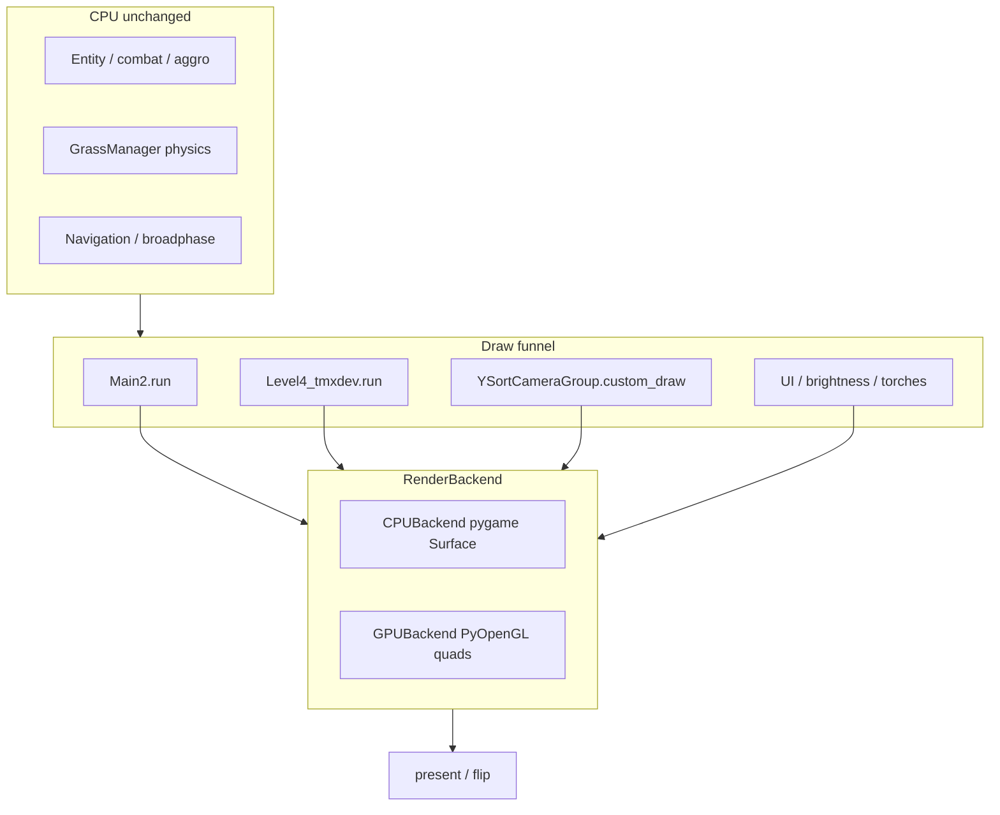

# GPU Render Backend — Master Plan

## Context and goal

Recent profiling ([`Code/stats_tottime.txt`](Code/stats_tottime.txt)) shows render dominates frame time:

| Hotspot | ~tottime | Notes |
|---------|----------|-------|
| `Surface.blit` | 36s | ~2M calls — primary migration target |
| Grass (`render_blade`, `transform.rotate`) | ~22s | Renders in-place on display subsurface |
| `display.update` | ~5s | Full-screen refresh every frame |
| CPU sim (broadphase, aggro, collision) | significant | **Stay on CPU** — not in GPU scope |

**CPU quick wins are done** (debug overlay off, text/image caches, grass rotation buckets, benchmark metrics no-op). Further gains require changing *how* we draw, not more micro-caches.

**Goal:** Introduce `RENDER_BACKEND = "cpu" | "gpu"` with a shared `RenderBackend` API so gameplay code stops calling pygame display/blit directly. Migrate draw paths in small, testable phases — never a big-bang rewrite.

---

## Architecture (target end state)



**Shared interface** (new module [`Code/render_backend.py`](Code/render_backend.py)):

```python
class RenderBackend:
    def get_size(self) -> tuple[int, int]: ...
    def begin_frame(self, clear_color=(0,0,0)): ...
    def blit(self, surface, dest, *, flags=0, area=None): ...
    def fill(self, color, rect=None): ...
    def present(self): ...
    @property
    def raw_surface(self) -> pygame.Surface | None: ...  # Phase 0 escape hatch — see below
```

**No `RenderBackend.subsurface()` in Phase 0.** Wrapping a pygame subsurface in another backend type is awkward and buys nothing — `GrassManager.update_render` must receive a real `pygame.Surface` it can draw into directly.

- **`CPUBackend`:** thin wrapper around existing `pygame.Surface` — zero visual change.
- **`GPUBackend`:** PyOpenGL orthographic 2D, textured quads, texture cache ([`Code/shader_test.py`](Code/shader_test.py) spike pattern; **PyOpenGL, not raw SDL2**).
- **Texture keys:** content/frame identity (path + frame index, or stable sprite frame id) — **not** `id(surface)` (animations reuse surfaces).

---

## Critical blocker (Phase 0)

Display is created in **two places** today:

1. [`Code/Main2.py:48`](Code/Main2.py) — `pygame.display.set_mode((w, h))` (no SRCALPHA)
2. [`Code/Level4_tmxdev.py:283`](Code/Level4_tmxdev.py) — **re-calls** `set_mode(..., pygame.SRCALPHA)` when `display_surface` is not passed

`Main2.start_level` does **not** pass a surface into `Level4(...)`, so the level path always hits the second `set_mode` — this would destroy an OpenGL context in GPU mode.

[`YSortCameraGroup.__init__`](Code/YsortCameraGroup.py) also calls `pygame.display.get_surface()` directly and creates a **grass subsurface** on the display (`line 103`).

**Phase 0 must fix ownership before any GPU work.**

---

## Phase 0 gate: SRCALPHA verification (not assumed)

Level4 re-creates the display with `pygame.SRCALPHA` because alpha compositing depends on it:

- [`Level4_tmxdev.py:1994`](Code/Level4_tmxdev.py) — torch/player halos: `BLEND_RGBA_ADD` onto display
- [`DaytimeBrightnessOverlay.draw`](Code/DaytimeBrightnessOverlay.py) — fullscreen `BLEND_RGB_MULT`
- Many overlay surfaces are `pygame.Surface(..., SRCALPHA)` — they need a display framebuffer that supports alpha blending

**Today:** Main2 creates a non-SRCALPHA display; Level4 immediately replaces it with SRCALPHA before gameplay draws. Moving `SRCALPHA` to Main2 changes *when* the flag is set (at startup, before Level4 init) — behavior should be equivalent, but this is **not settled until verified**.

**Phase 0 sub-plan must include explicit verification before merge:**

1. `Main2` calls `set_mode((w,h), pygame.SRCALPHA)` once; Level4 never calls `set_mode`.
2. **Visual checklist** (manual, documented in sub-plan):
   - Daytime: ground/sprites normal; `DaytimeBrightnessOverlay` tint visible at dusk
   - Night: torch halos visible; player brightness circles additive-glow correctly
   - No black fringe / wrong transparency on UI overlays
3. **Automated smoke (optional):** pixel sample on night frame — center torch region brighter than surrounding dark; fails if SRCALPHA path broken
4. If verification fails: investigate whether `convert()`/`convert_alpha()` on intermediate surfaces needs adjustment when display is SRCALPHA from frame 0 — do **not** proceed to Phase 1 until resolved

**OpenGL note:** GPU mode cannot use `SRCALPHA` on the pygame display surface — Phase 1 uses `OPENGL | DOUBLEBUF` instead. Alpha compositing for lights stays on CPU composite surfaces (uploaded as textures) until Phase 2c shader.

---

## Phase map and sub-plans

Work one phase at a time. Each phase gets its own detailed plan file under [`.cursor/plans/`](.cursor/plans/) when we start implementation.

| Phase | Sub-plan file (create when starting) | Effort | Outcome |
|-------|--------------------------------------|--------|---------|
| **0** | `gpu_phase0_cpu_backend.plan.md` | ~2–3 days | Single display owner, CPUBackend wired, no visual change |
| **1** | `gpu_phase1_gpu_foundation.plan.md` | ~1 week | GPUBackend boots level, uploads textures, basic blit parity |
| **2a** | `gpu_phase2a_sprite_batching.plan.md` | ~3–5 days | Batched Y-sorted sprites (biggest blit win after grass) |
| **2b** | `gpu_phase2b_grass_gpu.plan.md` | ~1–2 weeks | GPU grass instancing OR hybrid (CPU sim + one GPU blit) |
| **2c** | `gpu_phase2c_lighting_shader.plan.md` | ~3–5 days | Replace CPU day/night MULT + torch circle loops with shader |
| **3** | `gpu_phase3_menus_polish.plan.md` | optional | StartMenu, LevelSelection, SettingsMenu on backend |

**Dependency chain:** 0 → 1 → (2a, 2b, 2c in any order; 2b highest absolute savings) → 3

**Explicitly out of scope:** sim, aggro, pathfinding, obstacle grid — separate CPU perf track if needed later.

---

## Sub-plan summaries

### Phase 0 — CPU backend passthrough (`gpu_phase0_cpu_backend.plan.md`)

**Do first.** No GPU code yet.

1. Add `RENDER_BACKEND = "cpu"` and `DISPLAY_FLAGS = pygame.SRCALPHA` to [`Code/Settings.py`](Code/Settings.py).
2. Create [`Code/render_backend.py`](Code/render_backend.py) with `create_backend()` factory + `CPUBackend`.
3. **Centralize display in `Main2`:**
   - `set_mode((w,h), DISPLAY_FLAGS)` once in `Game.__init__`
   - Wrap result in `CPUBackend`; store as `self.backend`
   - Pass `backend` into `Level4(..., backend=...)` — Level4 holds reference, not a stale `get_surface()` snapshot
4. **Remove Level4 `set_mode` fallback** — assert backend provided; never recreate display from level.
5. **Audit gate (mandatory before wiring):** run ripgrep for `get_surface()`, `set_mode(`, and `.blit(` across level-path files; every hit must be in the inventory below or explicitly deferred. Phase 0 sub-plan includes this checklist — no approximate counts.
6. **Wire draw funnel** per exact inventory (next section).
7. **SRCALPHA verification** per gate section above.
8. **Defer:** menu states (`StartMenu`, `LevelSelection`, `PlayerConfiguration`) — keep direct `self.screen` until Phase 3.
9. **Tests:** backend factory returns CPUBackend; Level4 init does not call `set_mode`; grep test that level-path files have zero bare `pygame.display.get_surface()` outside `render_backend.py` factory.

**Grass subsurface — Phase 0 exception (intentional `raw_surface` use):**

Today [`YSortCameraGroup`](Code/YsortCameraGroup.py) does `self.grass_surface = self.display_surface.subsurface(clip_rect)` and passes that surface to `GrassManager.update_render`, which blits/rotates blades in-place. That API requires a native pygame subsurface, not a backend wrapper.

Phase 0 pattern:

```python
# YSortCameraGroup.__init__ — grass only; all other draws use backend.blit
self.grass_surface = backend.raw_surface.subsurface(clip_rect)
```

- **`raw_surface` is allowed here and only here** in Phase 0 (document in code comment).
- All compositing *out* of the grass region still goes through `backend.blit` (ground, sprites, overlays).
- **Phase 2b full GPU removes even the offscreen CPU path** — instanced blade quads; CPU keeps force/disturbance sim only.

---

### Phase 1 — GPU foundation (`gpu_phase1_gpu_foundation.plan.md`)

**Hard prerequisite — grass bridge (before GPUBackend ships):**

`GPUBackend.raw_surface` is **`None` by design** (OpenGL owns the framebuffer). Calling `backend.raw_surface.subsurface()` on the GPU path **will crash**.

Phase 0 allows display subsurface for grass on CPU only. Phase 1 must **not** defer this fix to Phase 2b:

```python
# YSortCameraGroup — required before RENDER_BACKEND=gpu works
if backend.raw_surface is not None:
    self.grass_surface = backend.raw_surface.subsurface(clip_rect)  # CPU path (Phase 0)
else:
    self.grass_offscreen = pygame.Surface(clip_rect.size, pygame.SRCALPHA)  # GPU path
    # each frame: update_render(grass_offscreen); backend.blit(grass_offscreen, clip_rect.topleft)
```

This is the hybrid grass path (CPU sim + one `backend.blit`) — pulled forward from Phase 2b as a **Phase 1 entry requirement**, not optional. Phase 2b then replaces `update_render` internals with GPU instancing, not the composite plumbing.

**Do not** provide a dummy display `raw_surface` on GPUBackend — it hides the bug and fights the OpenGL context.

1. Add `PyOpenGL` to [`requirements.txt`](requirements.txt) (spike already imports it; pin version).
2. Implement `GPUBackend`:
   - `set_mode(..., OPENGL | DOUBLEBUF)` only in factory when `RENDER_BACKEND == "gpu"`
   - `raw_surface = None`; add `is_gpu = True` (or check type) for grass branch above
   - Ortho projection matching window size; Y-flip for pygame coords
   - VAO/VBO for single textured quad; fragment shader with alpha
3. **Texture cache:** upload `pygame.Surface` → GL texture; key = `(path, frame_index)` or explicit `sprite.texture_key` attribute added during migration.
4. **`blit` on GPU:** draw one quad per call (same semantics as Phase 1 — batching is Phase 2a).
5. **Composite strategy for blend modes:** keep `BLEND_RGB_MULT` / `BLEND_RGBA_ADD` paths on CPU composite surfaces uploaded once per frame until Phase 2c shader.
6. **Validation:** side-by-side screenshot diff (CPU vs GPU) on static frame; night torch halo spot-check; toggle via Settings.

---

### Phase 2a — Sprite batching (`gpu_phase2a_sprite_batching.plan.md`)

Target: [`YSortCameraGroup.custom_draw`](Code/YsortCameraGroup.py) sprite loop (~252) and ground blit (~195).

- Collect draw commands during Y-sort pass: `(texture_id, dest_rect, z)`
- Single instanced or multi-draw call per frame
- Keep overhead areas and debug rects on slow path initially
- Measure: blit call count → near zero for sprites

---

### Phase 2b — Grass GPU (`gpu_phase2b_grass_gpu.plan.md`)

Target: [`GrassManager.render_blade`](Code/GrassManager.py) — replace CPU blade rotate/blit hot path.

**Prerequisite (done in Phase 1):** grass already composites via offscreen surface + `backend.blit` on GPU path.

**Full milestone:** instance blade quads with wind angle uniform; CPU keeps force/disturbance sim only.

**Known issue:** `BENCHMARK_GRASS_CLUSTER_FORCES_ENABLED = False` — cluster forces exist but unwired; optional CPU-side prep before GPU migration.

---

### Phase 2c — Lighting shader (`gpu_phase2c_lighting_shader.plan.md`)

Replace CPU paths:

- [`DaytimeBrightnessOverlay`](Code/DaytimeBrightnessOverlay.py) — fullscreen MULT tint
- [`Level4_tmxdev.py` ~1944–1994](Code/Level4_tmxdev.py) — per-frame torch/player circle loops on SRCALPHA surface

Single fullscreen pass: sample scene texture, apply time-of-day multiplier + radial light contributions in fragment shader.

---

### Phase 3 — Menus and polish (`gpu_phase3_menus_polish.plan.md`)

Migrate remaining ~30 blit sites in menu modules; remove remaining `raw_surface` uses (grass should already be gone after 2b); document `RENDER_BACKEND` in settings UI.

---

## Draw funnel inventory — exact (Phase 0 scope)

Production level path uses [`YsortCameraGroup.py`](Code/YsortCameraGroup.py) via [`tmx_layout_manager.py:139`](Code/tmx_layout_manager.py). Duplicate `YSortCameraGroup` classes embedded in [`Level4_tmxdev.py:2157+`](Code/Level4_tmxdev.py) are **dead code** — do not wire; optional cleanup note in sub-plan.

### Must route through `backend` in Phase 0

| File | Lines / call site | What |
|------|-------------------|------|
| [`Main2.py`](Code/Main2.py) | 320 | `pygame.display.update()` → `backend.present()` |
| [`Main2.py`](Code/Main2.py) | 364 | debug overlay blit |
| [`Level4_tmxdev.py`](Code/Level4_tmxdev.py) | 1835 | `display_surface.fill` → `backend.fill` |
| [`Level4_tmxdev.py`](Code/Level4_tmxdev.py) | 578, 610 | gold / RTS popup panels |
| [`Level4_tmxdev.py`](Code/Level4_tmxdev.py) | 971 | interact prompt |
| [`Level4_tmxdev.py`](Code/Level4_tmxdev.py) | 1740–1741 | popup shadow + text |
| [`Level4_tmxdev.py`](Code/Level4_tmxdev.py) | 1994 | torch/player halos `BLEND_RGBA_ADD` |
| [`Level4_tmxdev.py`](Code/Level4_tmxdev.py) | 1910 | `daytime_brightness_overlay.draw()` |
| [`Level4_tmxdev.py`](Code/Level4_tmxdev.py) | 1913 | `weather_overlay.draw()` |
| [`Level4_tmxdev.py`](Code/Level4_tmxdev.py) | 2036 | `ui.display()` |
| [`Level4_tmxdev.py`](Code/Level4_tmxdev.py) | 2120 | `layout_manager.display_time()` |
| [`Level4_tmxdev.py`](Code/Level4_tmxdev.py) | 2127 | `draw_belt_hud()` |
| [`Level4_tmxdev.py`](Code/Level4_tmxdev.py) | 2129 | `rts_session.draw()` |
| [`YsortCameraGroup.py`](Code/YsortCameraGroup.py) | 195, 252, 268 | ground + Y-sorted sprites + overhead |
| [`YsortCameraGroup.py`](Code/YsortCameraGroup.py) | 281, 290, 305 | debug draws (when flags on) |
| [`DaytimeBrightnessOverlay.py`](Code/DaytimeBrightnessOverlay.py) | 50 | `BLEND_RGB_MULT` fullscreen tint |
| [`WeatherOverlay.py`](Code/WeatherOverlay.py) | 90 | weather frame blit |
| [`tmx_layout_manager.py`](Code/tmx_layout_manager.py) | 194 | clock/time text blit |
| [`UI.py`](Code/UI.py) | 61, 78, 85, 94 | exp/level/weapon/magic blits (+ rects via backend) |
| [`Inventory.py`](Code/Inventory.py) | `draw_belt_hud` | belt slot blits (called from Level4) |

### Must eliminate bare `get_surface()` in Phase 0 level path

| File | Line | Fix |
|------|------|-----|
| [`Level4_tmxdev.py`](Code/Level4_tmxdev.py) | 280–283 | remove; receive `backend` from Main2 |
| [`YsortCameraGroup.py`](Code/YsortCameraGroup.py) | 42 | accept `backend` in ctor via layout_manager |
| [`UI.py`](Code/UI.py) | 12 | inject backend/surface from Level4 at init or per-frame |
| [`Upgrade.py`](Code/Upgrade.py) | 10 | inject when upgrade menu used (paused path) |
| [`DaytimeBrightnessOverlay`](Code/DaytimeBrightnessOverlay.py) | holds ref | set from Level4 via backend, not get_surface |

RTS session resolves surface via [`LevelRtsWorldAdapter.get_display_surface`](Code/Level4_tmxdev.py) — see **RTS adapter wiring** below.

### RTS adapter wiring (Phase 0 sub-plan must specify)

**Injection model: once at Level4 init, indirect via existing adapter — not per-call, not a separate adapter ctor param.**

Today: `Main2.start_level` → `Level4(...)` with no backend; Level4 sets `self.display_surface` via `get_surface`/`set_mode`; adapter is created at [`Level4_tmxdev.py:416`](Code/Level4_tmxdev.py) as `LevelRtsWorldAdapter(self)` and [`get_display_surface`](Code/Level4_tmxdev.py) returns `self.level.display_surface`.

Phase 0 change:

```text
Main2.__init__  →  create backend once
Main2.start_level  →  Level4(..., backend=self.backend)
Level4.__init__  →  self.backend = backend  (canonical owner inside level)
Level4.__init__  →  self.rts_world_adapter = LevelRtsWorldAdapter(self)  (unchanged ctor)
LevelRtsWorldAdapter  →  get_render_backend() returns self.level.backend
RtsSession.draw / camera_rect  →  use world.get_render_backend(), not get_display_surface()
```

**Concrete sub-plan tasks:**

1. Add `get_render_backend()` to [`RtsWorldAdapter`](Code/rts/world_adapter.py) (abstract) and [`LevelRtsWorldAdapter`](Code/Level4_tmxdev.py) — `return self.level.backend`.
2. Update [`RtsSession.draw`](Code/rts/session.py) (~639): `backend = self.world.get_render_backend()`; replace `surface.blit(...)` with `backend.blit(...)`; `pygame.draw.*` targets `backend.raw_surface` only where draw API requires a Surface (document each site), or add thin `backend` draw helpers if needed.
3. Update [`RtsSession.camera_rect`](Code/rts/session.py) (~142): `backend.get_size()` instead of `get_display_surface().get_size()`.
4. **Deprecate** `get_display_surface()` on the level adapter after the two call sites above migrate — do not leave it returning `pygame.display.get_surface()`.
5. RTS UI panels ([`resource_bar`](Code/rts/ui/resource_bar.py), [`panel`](Code/rts/ui/panel.py), etc.) continue receiving the draw target from `RtsSession.draw` — no change to their signatures in Phase 0 if session passes `backend.raw_surface` to panel `.draw(surface, ...)` **only** as a temporary shim, OR session passes backend and panels call `backend.blit` (prefer latter for funnel consistency; sub-plan picks one and lists panel files).

**Why not per-call injection:** `RtsSession` already holds `self.world`; the adapter already holds `self.level`. Adding `backend` to every `draw()` call duplicates the reference and drifts from the existing adapter pattern.

**Why not inject backend into `LevelRtsWorldAdapter.__init__` directly:** redundant with `LevelRtsWorldAdapter(level)` — `level.backend` is the single source of truth after Main2 passes it in.

### `raw_surface` exception (Phase 0 CPU only)

| File | Line | What |
|------|------|------|
| [`YsortCameraGroup.py`](Code/YsortCameraGroup.py) | 103 | `grass_surface = backend.raw_surface.subsurface(clip_rect)` |

### Deferred to Phase 3 (menus)

| File | Lines |
|------|-------|
| [`Main2.py`](Code/Main2.py) | 318 (`settings_menu.draw(self.screen)`) |
| [`StartMenu.py`](Code/StartMenu.py), [`LevelSelection.py`](Code/LevelSelection.py), [`PlayerConfiguration.py`](Code/PlayerConfiguration.py) | menu blits |

### Phase 0 sub-plan deliverable

Include a **completed grep checklist** (copy of above with checkboxes) so the executing pass cannot miss a site. Any new hit from ripgrep not on this list blocks merge.

---

## Draw funnel priority (by phase)

1. **P0 (Phase 0):** all "Must route through backend" + eliminate bare `get_surface()` rows above
2. **P1 (Phase 1):** same sites — GPUBackend implementations + grass offscreen branch
3. **P2 (Phase 2a–c):** optimize hot paths (sprites, grass blades, lights)
4. **P3:** deferred menu modules

---

## Success metrics (per phase)

| Phase | Pass criteria |
|-------|---------------|
| 0 | Game identical at `RENDER_BACKEND=cpu`; zero `set_mode` outside Main2; SRCALPHA visual checklist passed; grep audit clean; pytest green |
| 1 | Level loads at `RENDER_BACKEND=gpu`; grass offscreen branch works; no GL errors; visual parity on static + night torch spot-check |
| 2a | Sprite blit calls eliminated on GPU path; FPS uplift measurable in benchmark session |
| 2b | Grass `transform.rotate` hot path reduced; profile shows GL draw instead |
| 2c | Torch/brightness CPU surface allocation removed from level loop |

Re-profile with existing benchmark harness after each phase ([`Code/benchmark_runtime.py`](Code/benchmark_runtime.py)).

---

## Risks and mitigations

- **SRCALPHA timing:** not assumed — explicit visual verification gate in Phase 0 before merge; GPU path uses OPENGL flags, alpha compositing via CPU upload until Phase 2c.
- **Missed blit/get_surface sites:** mandatory ripgrep audit + exact inventory checklist in Phase 0 sub-plan; grep test in CI/pytest.
- **Grass subsurface on GPU:** Phase 0 CPU-only `raw_surface.subsurface()`; Phase 1 requires offscreen grass + `backend.blit` when `raw_surface is None` — **before** GPUBackend ships; no dummy raw_surface on GPU.
- **Animated sprites:** texture cache must invalidate on frame change — use explicit frame keys, not surface identity.
- **Scope creep:** menus deferred to Phase 3; blend shaders deferred to Phase 2c.

---

## What we do next

When you approve this master plan and switch to Agent mode:

1. Create **Phase 0 sub-plan** [`gpu_phase0_cpu_backend.plan.md`](.cursor/plans/gpu_phase0_cpu_backend.plan.md) with: exact blit/get_surface inventory (checkboxes), SRCALPHA visual checklist, grep audit gate, and RTS adapter wiring section (init injection + `get_render_backend()`)
2. Implement Phase 0 only — no GPU code
3. Re-run pytest + short playtest before touching Phase 1

Sub-plans for Phases 1–3 are **not written until their phase starts** — keeps the project under control and avoids stale multi-month plans.
